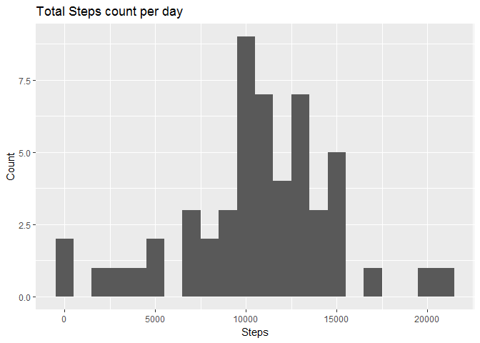

    knitr::opts_chunk$set(echo = TRUE)
    library(dplyr)

    ## 
    ## Attaching package: 'dplyr'

    ## The following objects are masked from 'package:stats':
    ## 
    ##     filter, lag

    ## The following objects are masked from 'package:base':
    ## 
    ##     intersect, setdiff, setequal, union

    library(ggplot2)

Loading and preprocessing the data
==================================

Download the file if it does not exist in the working directory
---------------------------------------------------------------

    url <- "https://d396qusza40orc.cloudfront.net/repdata%2Fdata%2Factivity.zip"
    destfile <- "activity.zip"

    if (!file.exists(destfile)){
      download.file(url, destfile, method = "auto", quiet=FALSE)
    }

Unzip the file and load the dataset
-----------------------------------

    unzip(destfile)
    activity_Data_withNA <- read.csv("activity.csv", header=TRUE, sep=",")

Process/transform the data into a format suitable for analysis
==============================================================

Remove records in which the number of steps are not available
-------------------------------------------------------------

    activity_Data <- activity_Data_withNA[!is.na(activity_Data_withNA[,1]),]

Calculate the total number of steps taken per day
-------------------------------------------------

    activity_df <- tbl_df(activity_Data)
    activity_sum <- activity_df %>% 
                      group_by(date) %>% 
                      summarise(sum_steps = sum(steps) 
                      )

Make a histogram of the total number of steps taken each day
------------------------------------------------------------

    ggplot(activity_sum, aes(x = sum_steps)) +
      geom_histogram(binwidth=1000) +
      labs(title = "Total Steps count per day", x = "Steps", y = "Count")

Calculate and report the mean and median of the total number of steps taken per day
-----------------------------------------------------------------------------------

    mean(activity_sum$sum_steps)

    ## [1] 10766.19

    median(activity_sum$sum_steps)

    ## [1] 10765

The average daily activity pattern
==================================

Make a time series plot (i.e. type="l") of the 5-minute interval (x-axis) and the average number of steps taken, averaged across all days (y-axis)
--------------------------------------------------------------------------------------------------------------------------------------------------

    activity_int <- group_by(activity_Data, interval)
    activity_int <- summarize(activity_int, steps=mean(steps))
    ggplot(activity_int, aes(interval, steps)) + geom_line()

The 5-minute interval, on average across all the days in the dataset, containing the maximum number of steps
------------------------------------------------------------------------------------------------------------

    activity_int[activity_int$steps==max(activity_int$steps),1]

    ## # A tibble: 1 x 1
    ##   interval
    ##      <int>
    ## 1      835

Imputing missing values
=======================

### Calculate and report the total number of missing values in the dataset

    activity_NA <- activity_Data_withNA[is.na(activity_Data_withNA[,1]),]
    nrow(activity_NA)

    ## [1] 2304

### Use the interval to fill in all of the missing values in the dataset.

    activity_mean_int <- activity_df %>% 
                      group_by(interval) %>% 
                      summarise(mean_steps = mean(steps)
                      )

    activity_NA$steps <- ifelse(activity_NA$interval==activity_mean_int$interval,activity_mean_int$mean_steps)
    activity_Data_imp <- rbind(activity_Data, activity_NA)

Make a histogram of the total number of steps taken each day and Calculate and report the mean and median total number of steps taken per day. Do these values differ from the estimates from the first part of the assignment? What is the impact of imputing missing data on the estimates of the total daily number of steps?
--------------------------------------------------------------------------------------------------------------------------------------------------------------------------------------------------------------------------------------------------------------------------------------------------------------------------------

    activity_sum_impute <- activity_Data_imp %>% 
                      group_by(date) %>% 
                      summarise(sum_steps = sum(steps) 
                      )
    mean(activity_sum_impute$sum_steps)

    ## [1] 10766.19

    median(activity_sum_impute$sum_steps)

    ## [1] 10766.19

### Mean is unaffected, while the median has increased slightly

Make a histogram of the total number of steps taken each day
------------------------------------------------------------

    ggplot(activity_sum_impute, aes(x = sum_steps)) +
      geom_histogram(binwidth=1000) +
      labs(title = "Total Steps count per day", x = "Steps", y = "Count")

Differences in activity patterns between weekdays and weekends
==============================================================

Create a new factor variable in the dataset with two levels - "weekday" and "weekend" indicating whether a given date is a weekday or weekend day.
--------------------------------------------------------------------------------------------------------------------------------------------------

    dayofweek <- weekdays(as.Date(activity_Data_imp$date))
    weekdayorend <- as.factor(dayofweek=="Saturday"|dayofweek=="Sunday")
    levels(weekdayorend) <- c("Weekday", "Weekend")
    activity_Data_imp$weekdayorend <- weekdayorend

Make a panel plot containing a time series plot (i.e. type="l") of the 5-minute interval (x-axis) and the average number of steps taken, averaged across all weekday days or weekend days (y-axis).
---------------------------------------------------------------------------------------------------------------------------------------------------------------------------------------------------

    activity_int <- group_by(activity_Data_imp, interval, weekdayorend)
    activity_int <- summarize(activity_int, steps=mean(steps))
    ggplot(activity_int, aes(interval, steps)) + geom_line() + facet_grid(. ~ weekdayorend) + ggtitle("Steps taken, averaged across all weekdays and weekends")

